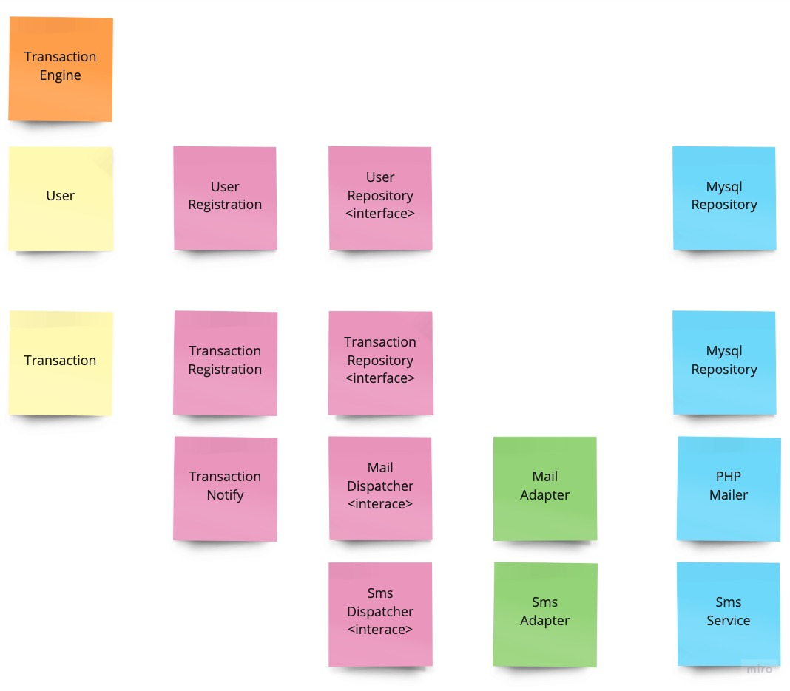
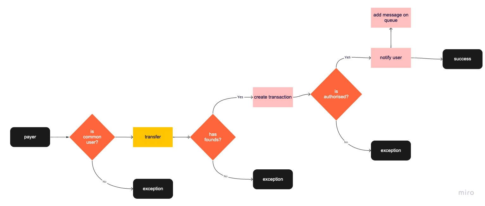

## Transaction Engine
 
#### Technologies used:
- Lumen Framework 8.0
- Nginx
- Docker
- PHPUnit
#### Features:
- Make transactions between users

#### Architecture:



### Installation
#### Clone repository

``` bash
$ git clone git@github.com:leandronascimento/transaction-engine.git transaction-engine
$ cd transaction-engine
```

#### Start Docker containers
``` bash
$ docker-compose up -d
```

#### Install compose dependency
``` bash
$ docker-compose exec php composer install
```

#### Run migrations
``` bash
$ docker-compose exec php php artisan migrate
```

#### Run seed
``` bash
$ docker-compose exec php php artisan db:seed
```

### Tests
#### Run tests
``` bash
$ docker-compose exec php ./vendor/bin/phpunit
```
#### Run PHPmd
``` bash
$ docker-compose exec php vendor/bin/phpmd ./app/ text cleancode,codesize,controversial,design,naming,unusedcode
```

#### Run PHPcs
``` bash
$ docker-compose exec php vendor/bin/phpcs ./
```

#### Run PHPcs fix
``` bash
$ docker-compose exec php vendor/bin/phpcbf ./
```


#### HTTP
- `GET http://localhost/api/transaction`

#### API
##### Make transaction
``` bash
$ curl --request POST \
  --url http://localhost/api/transaction \
  --header 'Content-Type: application/json' \
  --data '{
	"value" : 50,
	"payer" : "91263413013",
	"payee" : "11591323053"
}'
```

Response:
```json
{
  "message": "Transaction successful!"
}
```
